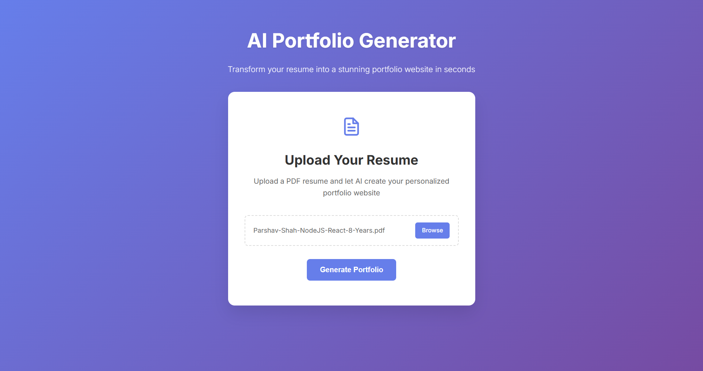
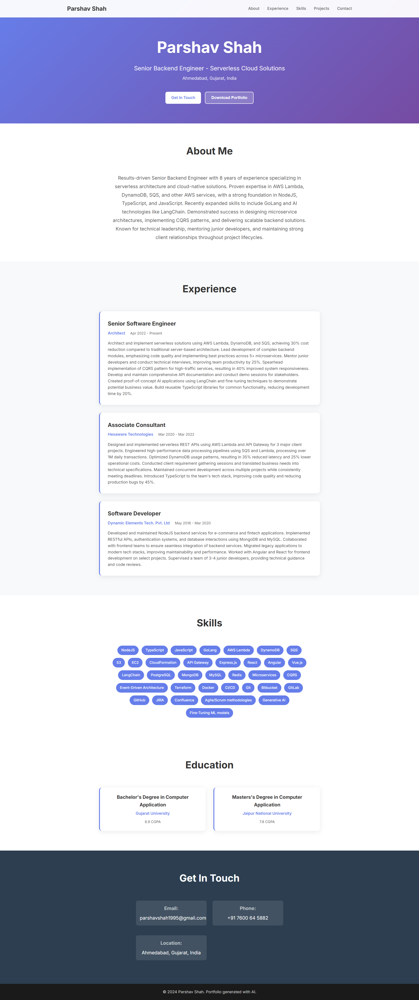

# AI Resume Builder

AI Resume Builder is a modern web application that allows users to upload their resume in PDF format, automatically extract structured information using OpenAI, and generate a beautiful, downloadable portfolio website in seconds.

## 🚀 Features
- **AI-Powered Resume Parsing:** Upload your PDF resume and let AI extract your professional details.
- **Instant Portfolio Generation:** Create a stunning, personalized portfolio website with one click.
- **Download as HTML:** Export your portfolio as a ready-to-use HTML file.
- **Live Preview:** Instantly preview your portfolio before downloading.
- **Secure & Private:** All processing is done securely; your data is not stored permanently.
- **Modern UI:** Clean, responsive design with customizable sections.

## 🖼️ Screenshots


*Homepage: Upload your PDF resume*


*Portfolio: Instantly generated preview*

## 🛠️ Tech Stack
- **Backend:** Node.js, Express.js, OpenAI API, pdf-parse
- **Frontend:** EJS templates, HTML5, CSS3, JavaScript
- **Security:** Helmet, CORS, Rate Limiting, Express Session
- **File Uploads:** Multer

## 📁 Folder Structure
```
├── controllers/         # Business logic (API, portfolio)
├── models/              # Data models (placeholder)
├── routes/              # Express route definitions
├── public/              # Static assets (CSS, JS)
├── views/               # EJS templates
├── uploads/             # (Optional) Uploaded files
├── index.js             # App entry point
├── package.json         # Project metadata
├── LICENSE              # MIT License
└── README.md            # Project documentation
```

## ⚡ Getting Started

### 1. Clone the repository
```bash
git clone https://github.com/parshavshah/ai-portfolio-generator.git
cd ai-resume-builder
```

### 2. Install dependencies
```bash
npm install
```

### 3. Set up environment variables
Create a `.env` file in the root directory:
```
OPENAI_API_KEY=your_openai_api_key
SESSION_SECRET=your_session_secret
PORT=5000
```

### 4. Run the application
```bash
npm start
```
Visit [http://localhost:5000](http://localhost:5000) in your browser.

## 📝 Usage
1. **Upload Resume:** On the homepage, upload your PDF resume.
2. **Review & Edit:** The app extracts your info using AI. Review and edit as needed.
3. **Generate Portfolio:** Click to generate and preview your portfolio website.
4. **Download:** Download your portfolio as a standalone HTML file.

## ✨ Customization
- Edit `public/portfolio.css` and `public/portfolio.js` for custom styles and interactivity.
- Update EJS templates in `views/` for layout changes.

## 🤖 Powered By
- [OpenAI GPT-3.5 Turbo](https://platform.openai.com/docs/models/gpt-3-5)
- [pdf-parse](https://www.npmjs.com/package/pdf-parse)
- [Express.js](https://expressjs.com/)

## 📄 License
This project is licensed under the [MIT License](./LICENSE) © 2024 Parshav Shah. 